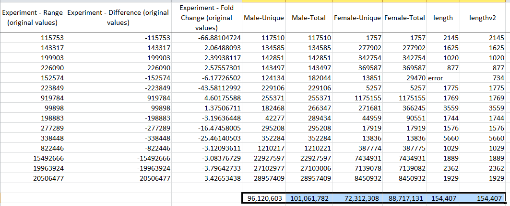
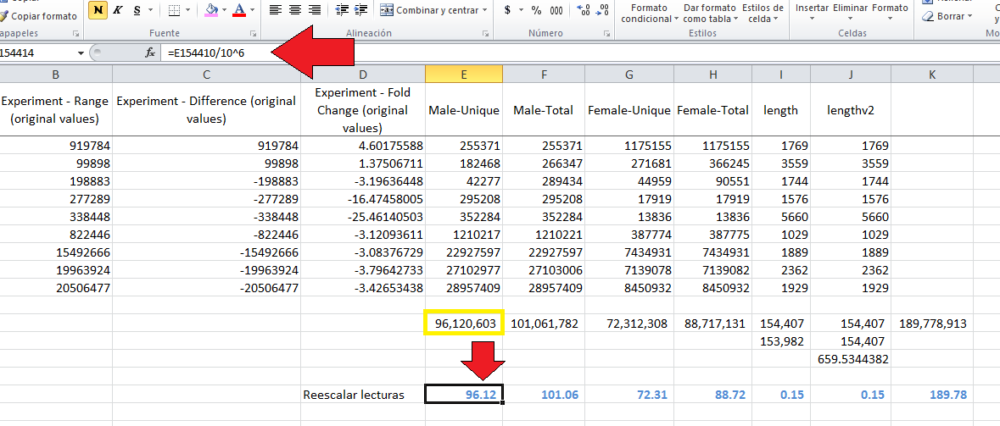
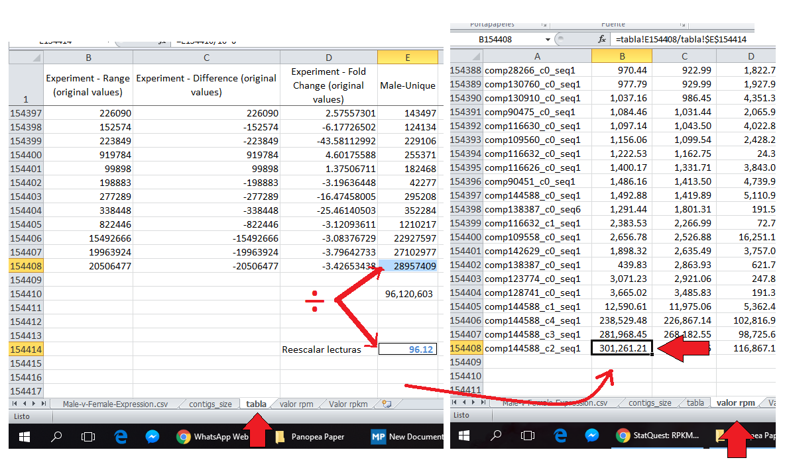
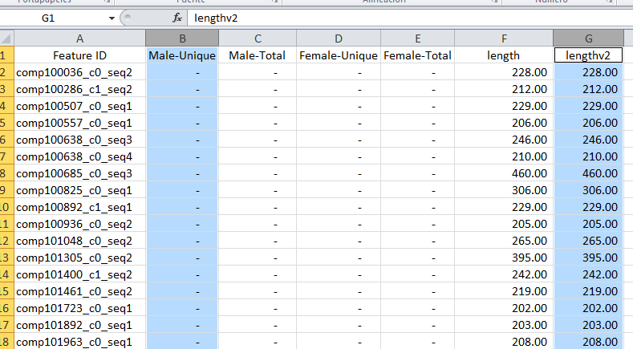
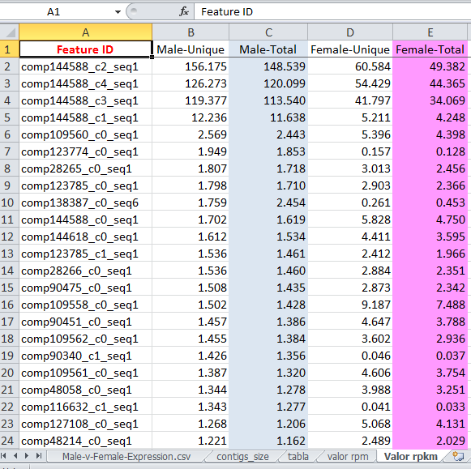

#RPKM
--

###Step1: Normalize for read depth

*1.1*	Calculate the total number of reads in each replicate (males and females):

*1.2* i'm scaling the total read counts by 1 million (this to make de numbers easier to read):

###Step2: Normalize for gene/contig length

*2.1* Calculate de reads per million for each replicate: to obtain __RPM__ (reads per milion value).

_Divide the read counts of each contig_

*2.2* We know the contig length, to obtain __RPKM__ values just need to divide RPM by the size of each contig.

*2.3* At the end we will obtain the rpmk value for each cell:

#this is correct? or I still lost?

